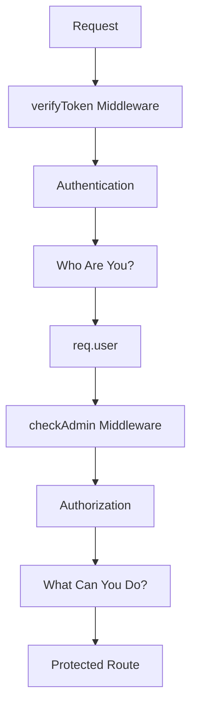
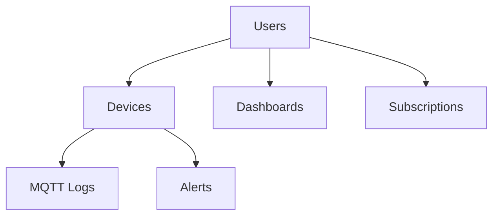
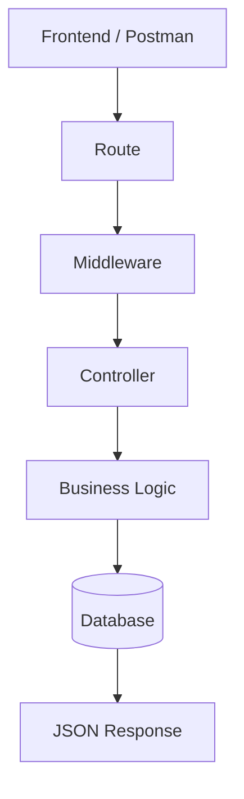

# Complete Authentication Flow (Graph Chart)

```mermaid
flowchart TD

A[Register] --> B[bcrypt.hash()]
B --> C[Store Hashed Password]
C --> D[(PostgreSQL)]

E[Login] --> F[SELECT User]
F --> G[bcrypt.compare()]
G --> H[jwt.sign()]
H --> I[JWT Token]

I --> J[Frontend LocalStorage]

J --> K[Authorization Bearer Token]
K --> L[verifyToken Middleware]

L --> M[jwt.verify()]
M --> N[req.user]

N --> O[Protected Route]

O --> P[checkAdmin Middleware]

P --> Q[Admin Route]
```

# JWT Middleware Verification Flow

```mermaid
flowchart TD

A[Request]
--> B[Authorization Header Exists?]

B -->|No| C[401 No Token Provided]

B -->|Yes| D[Extract JWT Token]

D --> E[jwt.verify()]

E -->|Invalid| F[401 Invalid Token]

E -->|Valid| G[Check Expiry]

G -->|Expired| H[401 Token Expired]

G -->|Valid| I[Get Payload]

I --> J[req.user = decoded]

J --> K[next()]

K --> L[Protected Controller]
```

# Authentication vs Authorization



# Database Relationship Concept



# Backend Request Lifecycle


